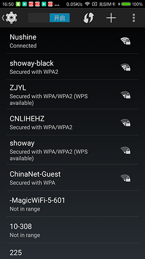

## 介绍
本项目是从Android 4.4 的setting源码中的抽取出来的 Wifi 连接模块, 经过一些修改, 在mi4 api23上运行通过

疑问:
1. 如何实现其他应用 startActivity(new Intent(Settings.ACTION_WIFI_SETTINGS)); 启动设置中的wifi列表界面, 并且按左上角的返回键可以返回

WifiConfiguration
    allowedKeyManagement (是BitSet类型, 键是KeyMgmt中定义的)
    wepKeys
    networkId
    status (值为 WifiConfiguration.Status 中的定义的常量)
    disableReason (值为: WifiConfiguration.DISABLED_AUTH_FAILURE, DISABLED_DHCP_FAILURE, DISABLED_DNS_FAILURE, DISABLED_UNKNOWN_REASON 之一)

    int INVALID_NETWORK_ID = -1;

ScanResult
    capabilities (Security)
    SSID
    BSSID
    level --> WifiManager.calculateSignalLevel(mRssi, 4); (RSSI: Received Signal Strength Indication)

WifiConfiguration 和 ScanResult 的区别? 是不是 WifiConfiguration 是指保存的wifi信息, 而 ScanResult 是指扫描到的wifi信息

WifiManager
    compareSignalLevel(other.mRssi, mRssi); // 内部实现很简单, 即是参1 - 参2
    List<WifiConfiguration> configs = mWifiManager.getConfiguredNetworks();
    List<ScanResult> results = mWifiManager.getScanResults();

Preference
    setWidgetLayoutResource(R.layout.preference_widget_wifi_signal);
    onBindView(View view)
    int compareTo(Preference preference) 返回值:0表示相等, 负数表示当前的Preference在形参之前,负数则相反
    setTitle(ssid)
    setSummary(CharSequence summary)
    notifyHierarchyChanged();
    getPreferenceScreen().addPreference(accessPoint);

PSK的类型:
    UNKNOWN,
    WPA,
    WPA2,
    WPA_WPA2

Security类型
    SECURITY_NONE = 0;
    SECURITY_WEP = 1;
    SECURITY_PSK = 2;
    SECURITY_EAP = 3;

remembered network  --> saved network  //if (mConfig != null) { // Is saved network

HashMap() put() 操作的时候, 即使key一样, 也不会覆盖. 待验证

总结: wifi扫描到连接的整个过程
--> mWifiManager.startScan()
--> WifiManager.SCAN_RESULTS_AVAILABLE_ACTION 广播
--> List<WifiConfiguration> configs = mWifiManager.getConfiguredNetworks(); --> 获取已配置过的network
    List<ScanResult> results = mWifiManager.getScanResults(); --> 获取当前扫描到的network. 这两者可能会有重复.  而且这个扫描到的结果可能会存在多个同名的现象, 所以过滤
    然后进行处理和排序
--> mWifiManager.connect(). //todo 在BOE中测试一下看看, 顺便再测试一下WifiSettings 中的receiver中的几个action

    或者
    WifiConfiguration wifiConfig = new WifiConfiguration(); 并且进行相关的成员变量的设置
    mWifiManager.save(wifiConfig, null);
    networkId = mWifiManager.addNetwork(wifiConfig);
    mWifiManager.enableNetwork(networkId, true);

PreferenceActivity --> addPreferencesFromResource(R.xml.test_pref);
Activity/PreferenceActivity --> PreferenceFragment -->  addPreferencesFromResource(R.xml.custom_pref); 可以自定义Preference, 然后添加至 R.xml.XXX 资源中

AccessPoints  network

## 获取 IP, 子网掩码, 网关的通用方法

	wifi_ipAddress.setText(WifiUtil.intToIp(wifiManager.getDhcpInfo().ipAddress)); // ip
	wifi_netmask.setText(WifiUtil.intToIp(wifiManager.getDhcpInfo().netmask)); // 子网掩码
	wifi_gateway.setText(WifiUtil.intToIp(wifiManager.getDhcpInfo().gateway)); // 网关

	/**
	 * 转换IP地址
	 *
	 * @param i
	 * @return
	 */
	public static String intToIp(int i) {
		return (i & 0xFF) + "." + ((i >> 8) & 0xFF) + "." + ((i >> 16) & 0xFF) + "." + ((i >> 24) & 0xFF);
	}